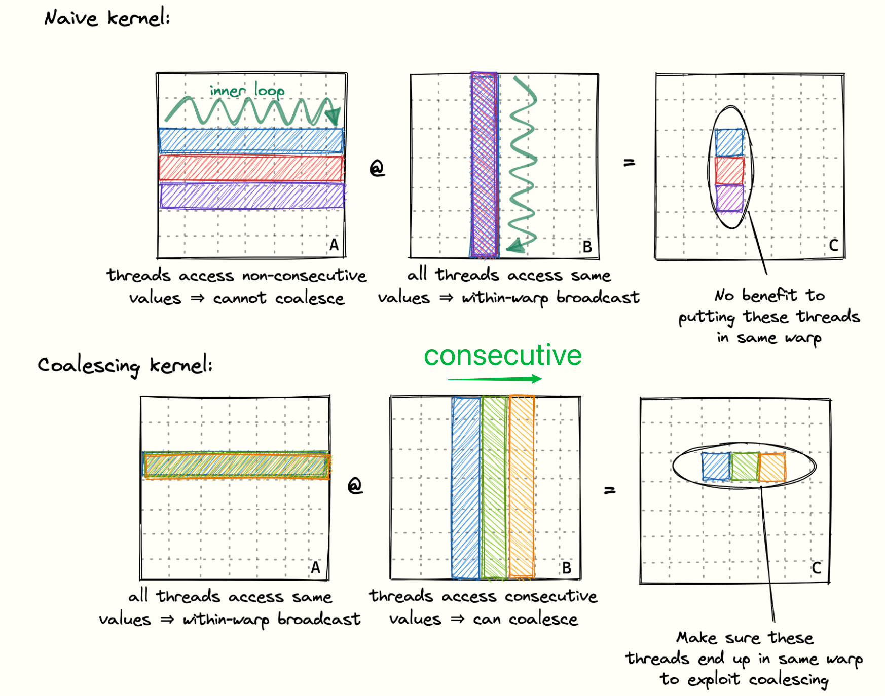
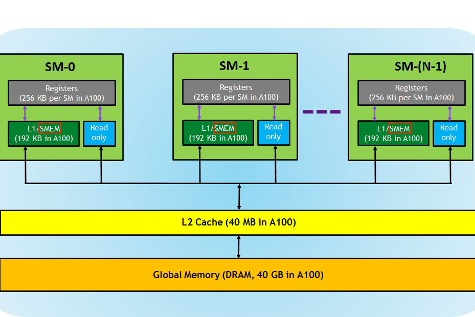

## Warp
- The threads of a block are grouped into so-called warps, consisting of **32 threads**.
- A warp is then assigned to a warp scheduler, which is the **physical core** that executes the instructions.
- There are **four** warp schedulers per multiprocessor.
- **Global memory coalescing**. It’s the most important thing to keep in mind when optimizing a kernel’s GMEM memory accesses toward achieving the peak bandwidth.


## Global Memory Coalescing
In reality, the GPU supports 32B, 64B and 128B memory accesses. So, if each thread is loading a 32bit float from global memory, the warp scheduler (probably the MIO) can coalesce this 32*4B=128B load into a single transaction. 

<div align="center">

</div>

To implement this, you only need to change the thread mapping strategy.

```c++
const int cRow = blockIdx.x * BLOCKSIZE + (threadIdx.x / BLOCKSIZE);
const int cCol = blockIdx.y * BLOCKSIZE + (threadIdx.x % BLOCKSIZE);
```

**Improvement**: `300GFLOPS` (Naive) --> `2000GFLOPS` (Coalesced).

## Shared Memory Cache-Blocking

Looking at the hierarchy of GPU memory:

<div align="center">

</div>

- Threads can communicate with the other threads in its block via the shared memory. 
- The maximum of shared memory for one block can up to 168 KB based on different compute capabilities.
- Bandwidth of shared memory is about 12TB/s, compared to 750GB/s for global memory. For Volta.


## Shared Memory Coalescing


## Debugging
1. ncu can't be used on the school's machines.
2. `make: *** No rule to make target 'build'.  Stop.`: I ran `make` in the wrong directory.

## References 

- https://siboehm.com/articles/22/CUDA-MMM  (Highly recommended)