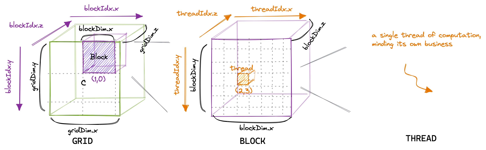
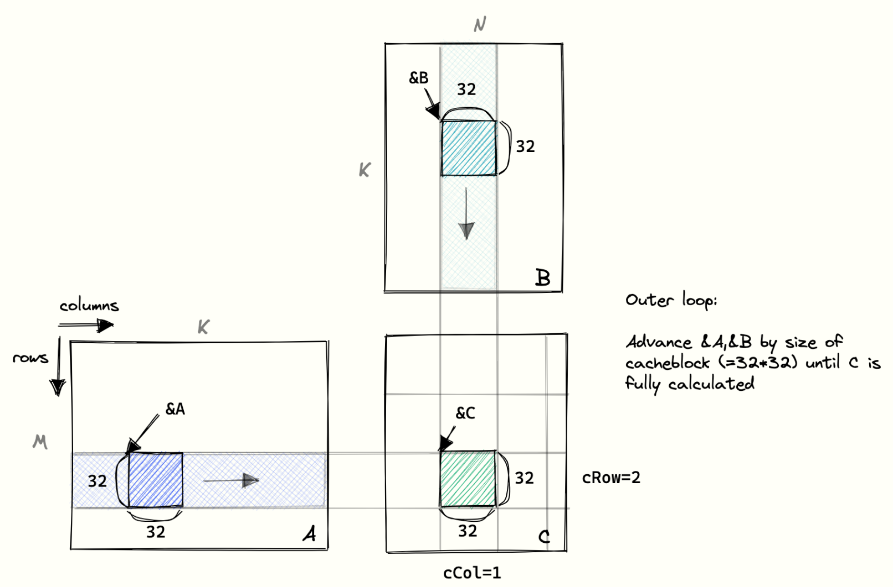

## Warp
- The threads of a block are grouped into so-called warps, consisting of **32 threads**.
- A warp is then assigned to a warp scheduler, which is the **physical core** that executes the instructions.
- There are **four** warp schedulers per multiprocessor.
- **Global memory coalescing**. It’s the most important thing to keep in mind when optimizing a kernel’s GMEM memory accesses toward achieving the peak bandwidth.

## Grid and Block

<div align="center">

</div>

syntax for grid and block:
```c++
dim3 grid(blockIdx.x, blockIdx.y, blockIdx.z);
dim3 block(threadIdx.x, threadIdx.y, threadIdx.z);
```
launch kernel:
```c++
kernel<<<grid, block>>>(args);
```

In reality, `blockIdx.x` controls the row id of the block, `blockIdx.y` controls the column id of the block. When you launch the kernel to compute the matrix with dimension of `M*N`, you may set the `blockIdx.x` to `(M+BLOCKSIZE-1)/BLOCKSIZE` and `blockIdx.y` to `(N+BLOCKSIZE-1)/BLOCKSIZE`.

So in your code, when you want to get the row id of the block, you can use `blockIdx.x * BLOCKSIZE` and the column id of the block, you can use `blockIdx.y * BLOCKSIZE`.
In this case, the `blockIdx.x` and `blockIdx.y` in the figure seems a little bit confusing.


Of course, you can change the meaning of `blockIdx.x` and `blockIdx.y` to control the column id and row id of the block respectively. But you need to take care of your code when you do this.


## Global Memory Coalescing
In reality, the GPU supports 32B, 64B and 128B memory accesses. So, if each thread is loading a 32bit float from global memory, the warp scheduler (probably the MIO) can coalesce this 32*4B=128B load into a single transaction. 

<div align="center">

</div>

To implement this, you only need to change the thread mapping strategy.

```c++
const int cRow = blockIdx.x * BLOCKSIZE + (threadIdx.x / BLOCKSIZE);
const int cCol = blockIdx.y * BLOCKSIZE + (threadIdx.x % BLOCKSIZE);
```

**Improvement**: `300GFLOPS` (Naive) --> `2000GFLOPS` (Coalesced).

## Shared Memory Cache-Blocking

Looking at the hierarchy of GPU memory:

<div align="center">

</div>

- Threads can communicate with the other threads in its block via the shared memory. 
- The maximum of shared memory for one block can up to 168 KB based on different compute capabilities.
- Bandwidth of shared memory is about 12TB/s, compared to 750GB/s for global memory. For Volta.

Don't scratch your head when counting the index, look at the figure below:

<div align="center">

</div>

Steps to build a kernel with shared memory cache-blocking:
1. Allocate shared memory for the current block:
```c++
__shared__ float As[BLOCKSIZE * BLOCKSIZE];
__shared__ float Bs[BLOCKSIZE * BLOCKSIZE];
```

2. Move the pointers to the starting position of the current block:
```c++
// cRow and cCol are the row and column id of the current block(correspond to C matrix)
A += cRow * BLOCKSIZE * K;                    // row=cRow, col=0 
B += cCol * BLOCKSIZE;                        // row=0, col=cCol
C += cRow * BLOCKSIZE * N + cCol * BLOCKSIZE; // row=cRow, col=cCol
```

3. Make inner index of threads ready:
```c++
// Only threadIdx.x is used, that means the threads in a block are mapped to a 1D array. 2D threads of course can be used, but you need to change how you declare the block `dim`.
const uint threadCol = threadIdx.x % BLOCKSIZE;
const uint threadRow = threadIdx.x / BLOCKSIZE;
```

4. Load the data into shared memory:
```c++
for (int bkIdx = 0; bkIdx < K; bkIdx += BLOCKSIZE) {
    // Have each thread load one of the elements in A & B
    // Make the threadCol (=threadIdx.x) the consecutive index
    // to allow global memory access coalescing
    As[threadRow * BLOCKSIZE + threadCol] = A[threadRow * K + threadCol];
    Bs[threadRow * BLOCKSIZE + threadCol] = B[threadRow * N + threadCol];
```

5. Move the pointers to the next block:
```c++
A += BLOCKSIZE;
B += BLOCKSIZE * N;
```

6. Compute the result


## Debugging
1. ncu can't be used on the school's machines.
2. `make: *** No rule to make target 'build'.  Stop.`: I ran `make` in the wrong directory.

## References 

- https://siboehm.com/articles/22/CUDA-MMM  (Highly recommended)